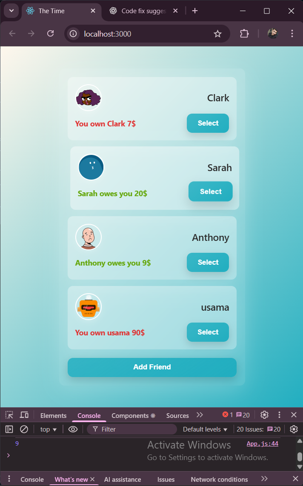
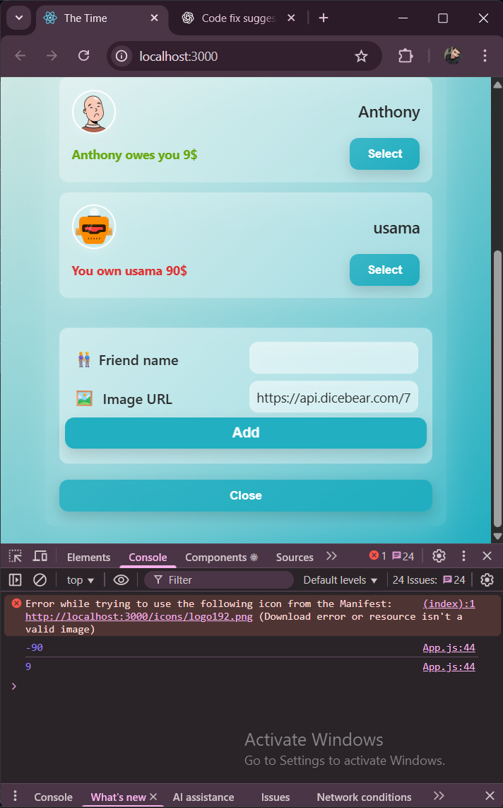
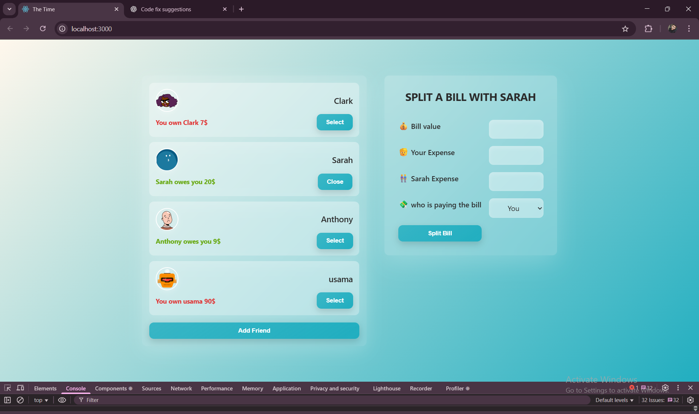

# 🧾 **Eat-N-Split**

A simple React web application to split bills between you and a selected friend. The app tracks balances (who owes whom) and gives a clean and modern UI for practicing React state management.

---

## 🚀 **Features**

### 👥 Manage Friends

- View a list of friends with avatars
- Track how much they owe you or you owe them
- Add new friends with custom names and image URLs

### 💵 Split Bills

- Choose a friend
- Enter bill amount and your personal expense
- Automatically calculate your friend’s part
- Select who paid the bill
- Friend’s balance updates instantly

### 🧠 React Concepts Practiced

- `useState`
- Conditional rendering
- Lifting state up
- Controlled components
- Form handling
- Component structure

---

## 🛠️ **Tech Stack**

- **React** (functional components)
- **JavaScript (ES6+)**
- **Dicebear Avatars API** for generating friend images
- **CSS** for basic styling

---

## 📸 **Preview**

This app allows you to:

- Add friends
- Select a friend
- Enter bill and expense
- Split the bill
- Update balances 🎉

<p align="center">
  
  
</p>

<p align="center">
  
</p>

---

## 📦 **How to Run Locally**

### 1️⃣ Clone the repo

```
git clone https://github.com/yourusername/split-bill-app.git
```

### 2️⃣ Install dependencies

```
npm install
```

### 3️⃣ Start the development server

```
npm start
```

App will run on
👉 [http://localhost:3000](http://localhost:3000)

---

## 🧮 **How Balance Works**

- If **you pay more**, your friend **owes you** → balance becomes **positive**
- If **your friend pays more**, **you owe them** → balance becomes **negative**
- If both pay equally → balance becomes **zero** (even)

---

## 📚 **Learning Purpose**

This app is a perfect practice project for learning:

- State lifting
- Form components
- Data flows between child → parent components
- Dynamic UI rendering
- React thinking pattern

---

## 🧑‍💻 **Learner**

**Usama**
Built learning and practicing React fundamentals.
